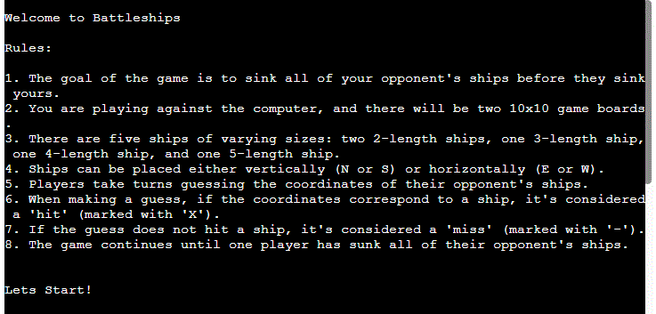
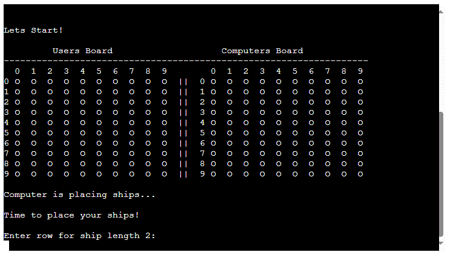

# Battleships #

## Description

Battleship, which originated as a pencil-and-paper game, has its roots in World War I, where it was played by Russian officers. In the 1930s, it emerged in the United States under the name "Salvo." The game was commercially launched in 1931 as "Broadsides: A Game of Naval Strategy" by the Starex company. In 1943, Milton Bradley introduced their own version, and in 1967, they released the well-known plastic board game featuring grids and pegs. The game's popularity increased significantly, paving the way for electronic adaptations such as "Electronic Battleship" in 1977 and "Electronic Talking Battleship" in 1989.

##  Game Rules
 ### Components
 
- Game Boards: Each player has two 10x10 grids. One grid is for placing their own ships, and the other grid is for tracking their guesses about the opponent's ship locations.
- Ships: Each player has a fleet consisting of five ships of varying lengths: 5, 4, 3, 2, 2.
- Markers: Used to track hits, misses, and ship placements on the grids.

### Setup

- Each player places their ships on their primary grid. Ships can be placed horizontally or vertically but cannot overlap or be placed diagonally.
- The placement of ships is hidden from the opponent.

### Gameplay

- Taking Turns: Players take turns calling out a coordinate on the opponent's grid (ex: row:5 column: 7) to attack.
- If the called out coordinate contains part of a ship, it's a hit, and the game marks this on the board with an "X".
- If it's a miss, the player marks it with "-".

 ### Winning the Game

 - The game continues with players alternating turns, calling out coordinates, and marking hits and misses. The first player to sink all of their opponent’s ships wins the game.

## User Experience

### Project Goals

- Provide straightforward instructions on how to play the game, including how to start, controls, and objectives.
- Provide feedback to users about their actions and the game state.

### Target Audience

- Casual Gamers: Fun and easy-to-understand gameplay, quick to start, and minimal setup.
- Players of all ages: Battleships is a game of strategy, memory, and logic, making it a timeless classic enjoyed by players of all ages.

## Features

Battleships game provides clear instructions and a straightforward interface. Players are welcomed with a set of easy-to-understand rules before starting the game. The game screen has dual-board display, where the user's board and the computer's board are shown side by side, making it easy to track progress. Placing ships is interactive and guided, ensuring that users understand how to position their fleet strategically. During gameplay, users make guesses by inputting row and column coordinates, receiving immediate feedback on their hits and misses. The alternating turns between the user and the computer keep the gameplay dynamic and exciting. Each turn is accompanied by clear prompts and visual updates, ensuring that players are always aware of the game state.

### Game Rules Screen

 

### Game Screen

 

## Testing
